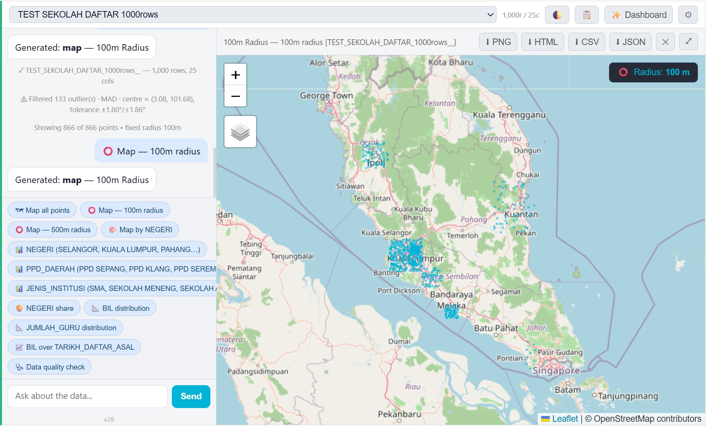
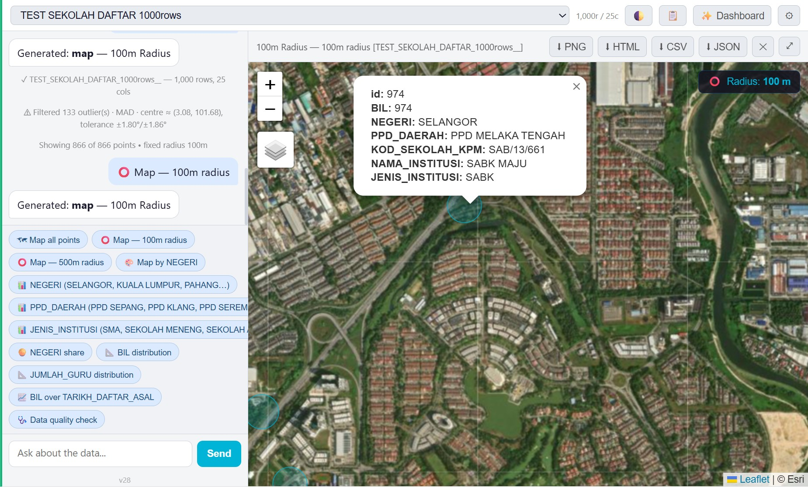

# AI Assistant in Grist

A self-hosted AI data assistant that lives inside a [Grist](https://www.getgrist.com/) spreadsheet as a Custom Widget. Ask questions in English, Chinese, or Malay; get back interactive charts, maps, dashboards, and answers — generated by your own local LLM via [Langflow](https://www.langflow.org/) + [Ollama](https://ollama.com/).

**Single HTML file, no build step, no framework.** Drop it into any Grist document, point it at your Langflow instance, and chat with your data.

```
┌─────────┐    ┌──────────────────┐    ┌──────────┐    ┌────────┐
│  Grist  │ ←→ │  grist_widget.html (this repo)  │ →  │ Langflow │ →  │ Ollama │
└─────────┘    └──────────────────┘    └──────────┘    └────────┘
   spreadsheet   plugin API + UI          orchestrator      local LLM
```

---

## Demo



*A 1,000-row Malaysian schools table rendered as a 100 m-radius point map. The left panel shows auto-generated suggestion chips derived from the schema — categorical breakdowns, distributions, time-series, data-quality check — all without typing a single query. The widget also reports **133 outliers filtered** using a MAD-based robust geo-bound, so distant typo coordinates don't blow up the map view.*



*Click any marker → full row popup with all non-empty columns (NEGERI, PPD_DAERAH, KOD_SEKOLAH_KPM, NAMA_INSTITUSI, JENIS_INSTITUSI, …). Toggle between street and satellite basemaps from the layers control on the left.*

---

## Features

- **Natural-language queries** in English, Chinese (Simplified/Traditional), and Bahasa Malaysia
- **Auto-generated chart types**: bar, line, pie, scatter, area, histogram, box plot, heatmap, ratio bar, choropleth
- **Geographic visualizations**: point maps, radius coverage, before/after relocation maps with route lines and Haversine distances
- **Dashboards**: 4–9 panel layouts with click-to-cross-filter
- **Stats & KPIs**: count, sum, avg, median, min/max, stddev with currency / metres / kilometres / percent formatting
- **Data quality audit**: missing values, duplicates, invalid coordinates
- **Filter chips** parsed from natural language ("only pending", "where status = active")
- **Schema-aware suggestions** — works even on headerless tables with generic column names (A, B, C)
- **Exports**: PNG screenshots, interactive standalone HTML, CSV/JSON
- **Theme**: dark / light toggle
- **Multi-turn**: previous chart context for follow-up questions ("change colors", "filter for X")

---

## Hardware requirements

The widget itself is a static HTML file — runs on **any device with a modern browser**, including phones. All the weight is in the LLM stack you self-host.

### To run the widget only (Grist + hosted widget)

| Resource | Requirement |
|---|---|
| Browser | Chrome / Edge / Firefox / Safari (last 2 years) |
| Network | HTTPS access to your hosted widget URL + your Langflow instance |
| Grist | Free hosted account at [getgrist.com](https://www.getgrist.com/) or self-hosted Grist Docker |

No special hardware on this side.

### To run Langflow + Ollama (the LLM stack)

This is where hardware matters. Pick based on the model size you want to run:

| Tier | Model size | RAM | GPU (VRAM) | Disk | Example models |
|---|---|---|---|---|---|
| **Minimum (CPU-only, slow)** | 3B quantized | 8 GB | none | 10 GB | `llama3.2:3b`, `phi3:mini`, `qwen2.5:3b` |
| **Recommended** | 7B–8B quantized | 16 GB | 8 GB | 20 GB | `llama3.1:8b`, `qwen2.5:7b`, `mistral:7b` |
| **Smooth** | 13B–14B quantized | 32 GB | 12 GB | 30 GB | `qwen2.5:14b`, `llama3.1:13b` |
| **Best quality** | 32B–70B quantized | 64 GB+ | 24 GB+ | 50 GB+ | `qwen2.5:32b`, `llama3.1:70b` |

**Notes:**
- GPU is optional but transforms response latency from ~30 s to ~3 s on the 7B tier.
- NVIDIA cards work out of the box with Ollama. Apple Silicon (M1/M2/M3/M4) uses unified memory and gets GPU acceleration automatically — a Mac with 16 GB RAM runs 7B models very well.
- Quantized (`Q4`/`Q5`) models are what Ollama ships by default. Full-precision FP16 needs roughly 2× the VRAM listed.
- Langflow itself is lightweight (~500 MB RAM, no GPU). All the heavy lifting is Ollama serving the model.
- Disk numbers include the model weights only — add a few GB for Ollama + Langflow + Docker overhead.

### Operating system

| OS | Status |
|---|---|
| Linux | ✅ Fully supported (recommended for production) |
| macOS (Intel / Apple Silicon) | ✅ Fully supported |
| Windows 10 / 11 | ✅ Supported via native binaries or WSL2 |

### Bandwidth

The widget sends ~10–50 KB per question (schema + prompt) and receives ~1–10 KB (JSON spec). Negligible for any wired or Wi-Fi connection. Initial CDN assets (Plotly + Leaflet) total ~700 KB, cached after first load.

---

## Quick start (5 minutes)

1. **Host this HTML somewhere reachable by Grist over HTTPS** — the easiest is GitHub Pages (see [Hosting](#hosting-the-widget) below).
2. **Run Langflow + Ollama locally** and import a Flow that uses the [system prompt](#langflow-system-prompt) below.
3. **In Grist**: add a Custom Widget, paste your hosted widget URL, set Access Level to **Full document access**.
4. **In the widget**: click the ⚙ icon and fill in your Langflow URL, API Key, and Flow ID.
5. **Pick a table from the dropdown** and start asking questions.

That's it. No backend, no database, no auth server. Everything runs on your machine.

---

## Setup in detail

### Grist side

1. Open your Grist document.
2. Click the **+** in the top-right → **Add Widget to Page** → **Custom**.
3. Paste your hosted widget URL (see next section).
4. Click the widget's gear icon → **Widget options** → **Access level**.
5. Set it to **Full document access**.

Without "Full document access" the widget can list tables but cannot read their data.

### Hosting the widget

The widget is a single static HTML file. Pick any static host:

#### Option A — GitHub Pages (free, public)

1. In this repo's GitHub settings, go to **Pages**.
2. Set **Source: Deploy from a branch**, branch **main**, folder **/ (root)**.
3. Save. After ~1 minute your widget is at:
   ```
   https://<your-username>.github.io/AIassistant-In-Grist/grist_widget.html
   ```
4. Use this URL in the Grist Custom Widget settings.

#### Option B — `raw.githack.com` (zero-setup CDN over your raw GitHub files)

```
https://raw.githack.com/<your-username>/AIassistant-In-Grist/main/grist_widget.html
```

#### Option C — Vercel / Netlify / your own server

Any static-file host works. The widget makes no server-side calls of its own.

### Langflow side

You need a running Langflow instance with a Flow that:

1. Accepts the user's prompt as `input_value` via `POST /api/v1/run/{flow_id}?stream=false`
2. Returns either:
   - Plain text (for casual conversation), or
   - A single raw JSON object describing the chart/map/dashboard to render (the **spec** contract — see code section below)

The actual reasoning is done by an LLM node inside Langflow (we use Ollama locally with a Llama-3 family model, but any chat model works).

**Required Langflow Flow inputs:**
- A text input node (`input_value` from API)
- A chat/LLM model node with the system prompt below
- An output node

You'll also need:
- **Langflow URL**: typically `http://localhost:7860` (or wherever you run it)
- **API Key**: generate from Langflow UI → **API Keys**
- **Flow ID**: the UUID of your Flow, visible in the URL when editing the flow

### Configuring the widget

1. Click the ⚙ icon in the widget's top-right.
2. Fill in:
   - **Langflow URL** — e.g. `http://localhost:7860`
   - **Langflow API Key** — from Langflow's API Keys page
   - **Flow ID** — UUID of your Flow
3. Click **Save**. Values persist in your browser's `localStorage` only — they are **never** sent anywhere except to your own Langflow instance.

---

## Langflow system prompt

The LLM behavior is controlled entirely by its system prompt. The full prompt is kept in a separate file so you can copy it verbatim into Langflow:

📄 **[`langflow_system_prompt.md`](langflow_system_prompt.md)**

Paste its content (everything inside the code block, or click "Raw" on GitHub) into the system-prompt field of your LLM/chat model node in Langflow.

The widget injects additional context before each query (schema, sample values, capability constraints, intent routing) — see [`buildPrompt` in `grist_widget.html`](grist_widget.html) (search for `function buildPrompt`).

---

## How it works

```
┌────────────────────────────────────────────────────────────────┐
│  User types in chat panel: "show me a map of pending sites"   │
└──────────────────────┬─────────────────────────────────────────┘
                       │
                       ▼
┌────────────────────────────────────────────────────────────────┐
│  sendMessage()                                                 │
│   ├─ parseFilters(text)        → extract "where ... = ..."     │
│   ├─ buildMeta()               → schema + sample_values        │
│   ├─ buildPrompt(text, meta)   → prompt with routing rules     │
│   └─ callLangflow(prompt)      → HTTP POST to Langflow         │
└──────────────────────┬─────────────────────────────────────────┘
                       │
                       ▼
                  Langflow + Ollama
                       │
                       ▼
                  Returns spec JSON
                       │
                       ▼
┌────────────────────────────────────────────────────────────────┐
│  parseSpec(raw)                → tolerant JSON parser          │
│  preprocessSpec(spec)          → compute distance_calc cols    │
│  renderViz(spec)               → switch on spec.type:          │
│    ├─ renderBar / renderLine / renderPie / ...                 │
│    ├─ renderMap (Leaflet)                                      │
│    ├─ renderShiftMap (Leaflet)                                 │
│    └─ renderDashboard (grid of mini-renderers)                 │
└────────────────────────────────────────────────────────────────┘
```

**The "spec" is the contract.** Everything between the user typing and a chart appearing on screen revolves around one JSON object — type-tagged, fully declarative, validated by `parseSpec`, dispatched by `renderViz`. Swap out Langflow for any other LLM orchestrator, keep the spec shape, and the widget still works.

---

## Code breakdown

The file is intentionally a single ~4400-line HTML document with no build step. Sections are separated by visible `// =====` banners. Below is a map of the major regions.

| Lines (approx.) | Section | What it does |
|---|---|---|
| 1–300 | `<head>`, CSS | Layout, theme variables, light/dark mode, dashboard grid |
| 300–365 | HTML body | Topbar, chat panel, viz panel, settings popover |
| 365–425 | Config + storage | `CFG` object, `loadConfig`/`saveConfig` from localStorage |
| 425–510 | Coord-pair detection | Auto-detect `lat_old`/`lat_new` pairs for `shift_map` |
| 510–600 | Grist init | `grist.ready`, `listTables`, table dropdown wiring |
| 600–740 | Smart suggestions | `detectGeoByValues` (value-based geo detection), `generateSuggestions` (auto-chips on table load) |
| 740–895 | `buildMeta` | Schema extraction: types, ranges, sample_values, geo/range/date column inference |
| 895–1010 | `buildPrompt` | Constructs the LLM prompt: routing rules, capability constraints, schema, samples |
| 1010–1090 | Local chitchat | Handles greetings without calling the LLM |
| 1090–1230 | `callLangflow` / `callLangflowStream` | HTTP fetch with retry, abort, timeout |
| 1230–1310 | Chat memory (UI) | Save/load chat to localStorage; render messages |
| 1310–1500 | `sendMessage` | Main orchestration: parse filters → build prompt → call → render |
| 1500–1560 | `parseSpec` | Tolerant JSON parser — fences, single quotes, trailing commas |
| 1560–1680 | `resolveColumn` | Exact → normalized → word-subset → fuzzy (Levenshtein) column matching |
| 1680–1820 | `aggregate` / `parseAsDate` / filter eval | Core grouping + filter engine |
| 1820–2000 | Dashboard save / panel insertion | localStorage dashboards, manual panel add |
| 2000–2090 | `renderViz` dispatch | The switch that routes spec.type → renderer |
| 2090–2240 | Audit + Stat | Data-quality checks and KPI cards |
| 2240–2620 | Dashboard renderer + mini-renderers | One mini-renderer per chart type |
| 2620–2900 | Stat compute, table render | `computeStat`, `getTableRows`, `tableHtml` |
| 2900–3210 | Plotly renderers | bar, line, area, pie, scatter, histogram, box, heatmap |
| 3210–3340 | Choropleth | GeoJSON region coloring |
| 3340–3600 | Map renderer | Leaflet point map with clustering, color, radius |
| 3600–3870 | Shift map | Old/new pair lines, Haversine distances, outlier filter |
| 3870–4040 | Map outlier filter | MAD-based robust bounds for noisy coords |
| 4040–4090 | PNG / CSV / JSON export | `html2canvas` + Blob download |
| 4090–4400 | Standalone dashboard HTML export | Self-contained HTML with embedded data + minified renderers |
| 4400–end | Settings UI, theme | ⚙ panel handlers, light/dark toggle |

### The data flow in one paragraph

`loadTable()` pulls the selected Grist table into the in-memory object `tableData` (a column-oriented `{ColName: [v1, v2, ...]}` shape). `buildMeta()` derives a compact schema. When the user sends a question, `buildPrompt()` packages the schema + sample rows + routing rules into a single text prompt and `callLangflow()` POSTs it. Langflow's LLM returns a **spec JSON** describing what to draw. `parseSpec()` extracts the JSON from whatever wrapping it arrived in, `preprocessSpec()` computes any derived columns (`__distance_km__` etc.), and `renderViz()` dispatches by `spec.type` to a Plotly or Leaflet renderer.

### Adding a new chart type

1. **Add the type to the supported set** in `handleNonRenderableSpec` (around line 1298 — the `renderable` Set).
2. **Write a renderer**, e.g. `renderRadar(spec)` — read columns via `resolveColumn`, apply `getFilteredIndices(spec.filters)`, call `Plotly.react("plotly-div", traces, layout)`.
3. **Add a case** in the `switch(spec.type)` inside `renderViz` (around line 2068).
4. **Add a dashboard mini-renderer** `dashRenderRadar(divId, spec)` and a case in `renderPanel`.
5. **Document the type** in the system prompt (add a line to `## SUPPORTED JSON TYPES`).

Adding a new chart should take 30–60 lines of code, mostly Plotly trace construction.

---

## FAQ

**Q: Do I need a Grist API key?**
No. The widget uses Grist's in-browser **Plugin API** (`grist.docApi`), which authenticates via Grist's iframe permission system. You grant access once in the Grist UI ("Full document access") — no token is involved. The settings panel only collects the Langflow credentials because Langflow is a separate HTTP service.

**Q: Why is my Langflow API key in the URL bar / network tab?**
It isn't. The key is sent in the `x-api-key` header, never the URL or query string.

**Q: The LLM keeps returning a dashboard when I just want a single chart.**
The widget already injects an anti-dashboard routing rule before each prompt. If it still happens, the most likely cause is a Langflow system prompt that defaults to dashboards. Use the system prompt provided above verbatim.

**Q: My table has no headers (columns named A, B, C) — barely any suggestions show up.**
The widget falls back to **value-based** detection: numeric columns in `[-90, 90]` with decimals become candidate latitudes, etc. You should still see at least "🔢 Total records" and "🩺 Data quality check". If a column you expect to be geo isn't detected, rename it to include `lat`/`lon` in Grist.

**Q: Filters in natural language don't always work.**
The widget parses a few common patterns (`where X = Y`, `only Z`). Anything more nuanced goes through the LLM, which is more flexible but slower. Filter chips appear in the panel below the chat — click ✕ to remove them.

**Q: Where is the chat history stored?**
Browser `localStorage` only (key `grist_widget_chat`). Cleared with browser data; not synced anywhere.

**Q: How do I export the data underlying a chart?**
The CSV / JSON buttons in the viz panel toolbar export the raw table. For chart screenshots use the PNG button. Maps and dashboards additionally have an "interactive HTML" download — a standalone file that opens in any browser and includes the data + renderer code.

**Q: Can this work with OpenAI / Anthropic / other LLM providers instead of Langflow?**
The widget only talks to one endpoint: `POST {lfUrl}/api/v1/run/{flowId}`. To swap providers, either:
- Use Langflow's provider nodes (it supports OpenAI, Anthropic, Mistral, etc. via configurable model nodes), or
- Change `callLangflow` in the widget to hit your provider directly, keeping the response contract the same.

**Q: Does it handle large tables?**
Yes — the widget was hardened against tables in the tens of thousands of rows (uses iterative min/max to avoid argument-stack overflows on `Math.min(...arr)`). Above ~100k rows, expect Leaflet to slow down on point maps without clustering.

---

## License

MIT. See [LICENSE](LICENSE).

Built on top of [Grist Plugin API](https://support.getgrist.com/widget-custom/), [Plotly.js](https://plotly.com/javascript/), [Leaflet](https://leafletjs.com/), [Langflow](https://www.langflow.org/), and [Ollama](https://ollama.com/).
